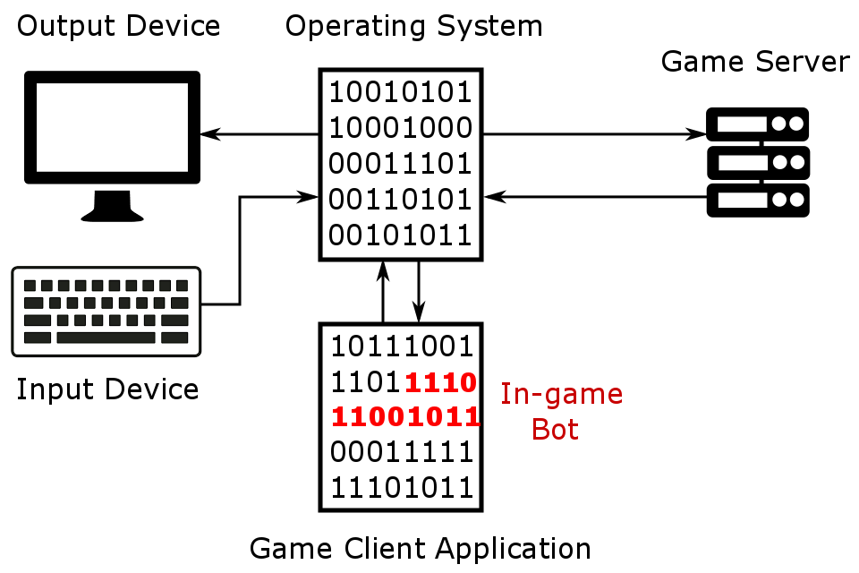
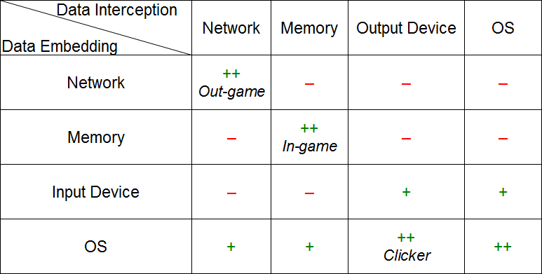

# Types of Bots

## Community Classification

You can often find references to the **in-game** and **out-game** types of bots while you searching information about them on the Internet. These terms are widely used and well known in a gamer community.

In-game bot is a software that is embedded inside the game client application's process. Bot provides own functionality by extending capabilities of the game client. This is a scheme of interaction the in-game bot and a game application:

Out-game bot is a software that works outside the game client application's process. First kind of out-game bots does not need the game application at all. The bot substitutes the game client. Therefore a game server supposes, that it communicates with an usual game client application, while in reality there is the out-game bot. This is a scheme of interaction the standalone out-game bot and the game server:

Second kind of out-game bots works with a game client application's process in a parallel manner. These bots are able to gather information about a state of the game objects and and to notify the game application about the simulated player's actions through the system libraries of OS:

Also you can be faced with a mention about the **clicker** type of bots. This is a special case of the out-game bots. Clicker bots send the keyboard and mouse events notifications to the game application's process through the system libraries or drivers.

We will use the **community classification** term for naming these three kinds of bots.

## Developers Classification

Community classification is quite convenient for users of the bot applications. The problem is that the classification reflects, how the bot application works. But it does not reflect which approaches and methods it uses. Therefore it can be not enough for the bot developers. We can avoid this kind of the information lack, if we choose another basis for the bots classification. I suggest to consider actual methods, that a bot application uses to capture data about the game objects and methods to simulate player's actions. These methods are able to become a new basis for the bots classification.

Now we will consider points in our game application scheme, where the bot is able to capture a state of the game objects. These points of the data gathering are marked by the red crosses:

This is a list of the data capture points:

1. **Output Devices** 
It is possible to capture data from the output devices like a monitor or an audio card. This feature of the data capture is provided by the system libraries of OS. When game objects are drew on the screen, they have the specific colors. Similar game events are often accompanied by the specific sounds, that are reproduced by an audio card. You can compare these captured colors and sounds with the predefined values. It allows you to make a conclusion about the current state of objects.

2. **Operating System** 
You can substitute or modify some system libraries or drivers of OS. It allows you to trace interactions between the game application and OS. Another way is to launch the game application under an OS emulator like Wine or others. Emulators often have an advanced logging system. Thus you will get a detailed information about each step that has been performed by the game application.

3. **Game Server** 
[**Network packets**](https://en.wikipedia.org/wiki/Network_packet), that are sent to the game application from the game server, can be captured. Current state of the game objects is transmitted this way in most cases. Therefore you can get this state by analyzing of the captured packets.

4. **Game Client Application** 
You can get an access to the memory of a game application's process and read the state of game objects from there. This feature of the interprocess communication is provided by the system libraries of OS. 

Result of a bot application's work is simulated player actions that should be transmitted to the game server. This scheme illustrates points (that are marked by the green crosses) where the bot application can embed its data:

This is a list of the data embedding points:

1. **Input Device** 
All input devices are legal from the point of view of OS. Therefore special devices can be used to substitute or emulate the standard input devices like a mouse or a keyboard. For example, you can use [**Arduino**](https://en.wikipedia.org/wiki/Arduino) board that will emulate a keyboard's behavior. This board can be controlled by a bot application.

2. **Operating System** 
Bot application is able to modify and to control some components of the OS. For example, you can modify a keyboard driver in the way, that allows a bot application to notify the OS about keyboard actions through this driver. In this case, the OS cannot distinguish whether the keyboard event has really happened or it has embedded by the bot. Also the interprocess communication feature allows you to simulate keyboard events for the specific process.

3. **Game Server** 
Bot application can send network packets with the simulated actions directly to the game server. It can be performed in the same way as the game client application does. Game server has no possibility to distinguish the network packet's source in some cases.

4. **Game Client Application** 
Bot simulated actions and a new game state are able to be embedded directly into the memory of game application's process. Thus the game application will consider, that  the player's actions have really happened and the new game state has been changed in a regular way.

We will use the **developer classification** term for naming bots with emphasizing their methods of the capturing and embedding data.

## Summary

Following table summarizes the community and developers bots classification:

Each crossing of the row and column defines the type of a bot application. A data capture method, that is used by bots of this type, matches to the column's heading. Similarly a data embedding method of the bot matches to the row's heading. Types of bots, that are match to the community classification, are specified in the corresponding table's cells

You can see plus and minus signs inside each cell. This signs illustrate an approximate evaluation of two parameters' balance for each bot's type:

1. How difficult is this method for the implementation?

2. How effective and reliable (error-free) is the bot application, that uses this combination of methods?

This is a description of the possible evaluation values:

| Evaluation value | Description |
| -- | -- |
| **–** | This combination of the data capturing and embedding methods requires the unreasonable work efforts. Effectiveness and reliability of the resulting bot applications can be easier achieved using other methods. |
| **+** | This combination of methods allows you to achieve accurate and effective solution. Also it requires reasonable work efforts. |
| **++** | This combinations of methods allows you to achieve the most effective or the simplest for implementation solution |

Now we can briefly explain the evaluation results:

1. **Network**  
Network packets analysis is one of the most difficult methods of the game data capture. You should implement the communication protocol between the game client and the game server. Obviously official documentation for this protocol is not available for anyone except the game's developers. Usually bot developer has a game application's executable file and examples of the already captured network packets only. Moreover network packets are often encrypted, and sometimes there is no way to decrypt it unambiguously. On the other hand, this method provides the most precise and complete information about the state of game objects. Bots, that are based on this method, can be very efficient thanks to the comprehensive information about the game state. 

2. **Memory** 
Memory analysis is the second difficult method to capture game data. Game developers distribute their applications in binary codes, that were produced by the [**compiler**](https://en.wikipedia.org/wiki/Compiler) from the game application's source code. There is no way to get the exact source code of the game application, that allows to analyze algorithms and data structures. Protection systems are able to relocate and to encrypt information regarding game objects in the memory of the game application's process. Patching the process memory is a quite dangerous method of embedding data because of possibility to crash the application. But this method provides almost the same comprehensive information about the game state as the network packets analyzing one.

3. **Output Device** 
Capturing of the output device data is one of the simplest methods to get the game state. Bit the method provides not reliable results. For example, algorithms of the image analysis may be wrong in some cases. Effectiveness of this method is heavily dependent on the features of a game application.

4. **Input Device** 
Embedding data with the special input device is a good way to avoid some types of [**anti-cheat protection systems**](https://en.wikipedia.org/wiki/Cheating_in_online_games#Anti-cheating_methods_and_limitations). But you need to buy the device itself and to write a firmware for it. It makes sense to use this method only when it is necessary to avoid the protection systems. This method works with the same effectiveness as the embedding data on the OS level.

5. **OS** 
Capturing data with the features provided by the OS system libraries is a quite universal and reliable method. There are open source [projects](https://graphics.stanford.edu/~mdfisher/D3D9Interceptor.html) that allows to wrap the system libraries by the third-party libraries. Game application will interact with these wrappers. Details of this interaction allows to get information about the game state. Embedding data with the OS system libraries is a simple method for implementation. But the bot applications, that use this method, can be detected easily by the protection systems.

You can see that a community classification covers the most effective and simplest for implementation combinations of the capturing and embedding data methods. On the other hand, rarely used and ineffective method combinations are not mentioned in the community classification. We will primarily use the community classification throughout this book. The developers classification will be used in the rare cases, when it is important to emphasize the bot's implementation details.