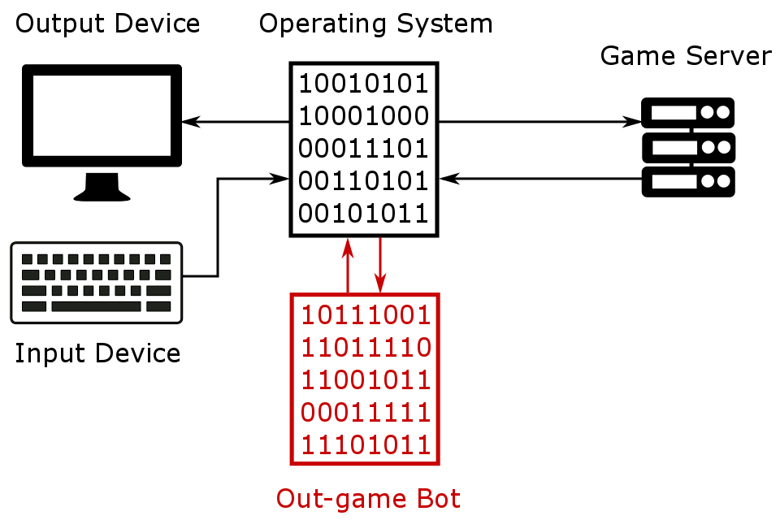
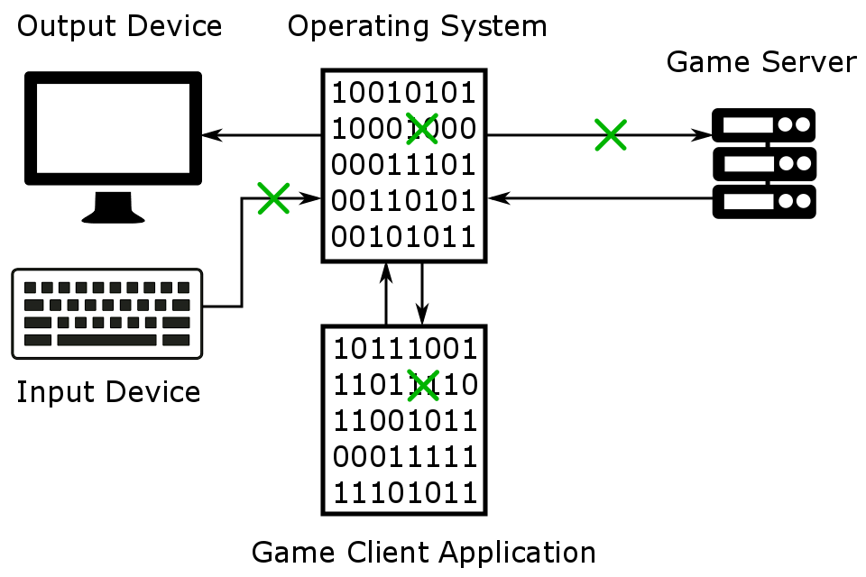

# Types of Bots

## Community Classification

You can often hear about **in-game** and **out-game** types of bots when trying to discover the information regarding bots in Internet. These terms are widely used and well known in the gamers community.

In-game bot is a software that embed inside the game client application's memory and provide its functionality by extending game client capabilities. This is illustration of in-game bot on the game application scheme:

Out-game bot is a software that works outside the game client application's memory. One kind of out-game bots doesn't need the game application at all. This bot substitute the game client. Thus, game server supposes that it works with an usual game client application while actually this is out-game bot. This is illustration of this kind out-game bots:

Another kind of out-game bots works with the game client application in parallel. This bot able to intercept the state of game objects and notify the game application about simulated player's actions through OS:

Also you can faced with a mention about **clicker** bots. This is a special case of the out-game bots that work with game application in parallel. Clicker bot sends the keyboard and mouse events notifications to game application through the OS. 

We will use **community classification** term for naming these three kind of bots.

## Developers Classification

The **community classification** is quite convenient for bot applications users but this is not enough for bot developers. The problem is this classification doesn't reflect how the bot application actually works and what kind of approaches it uses. It will be better to use as classification basis the methods that bot application uses for [intercept data about the game objects and embed data about simulated player's actions](http://stackoverflow.com/questions/2741040/video-game-bots).

Let's consider points on our scheme of the game application where bot able to intercept the state of the game objects. The points of data intercepting is marked by red crosses:

This is a list of the data interception points:

1. **Output devices**. It is possible to capture data from the output devices like monitor or audio column. Game objects have a specific colors and game events is accompanied by sounds often. You can compare these colors or sounds with predefined predefined values and make conclusion about the current objects state.

2. **Operation system**. You can substitute or modify some libraries or drivers of operation system. This allow you to trace the notifications that are sent to the game client application and the requests to OS from the application. Another way is launching game application on a emulator of the operation system like Wine. Emulators have an advanced logging system often. Thus, you will get a detailed information about each step of the game application work.

3. **Game server**. The network packets that are sent to the game application from the game server can be intercepted. The current state of the game objects is transmitted by this way in most cases.

4. **Game client application**. You can get access to the game application memory and gather necessary information from there.

Result of the bot application work is a simulated player actions that should be transmitted to the game server. This is a scheme specifies the points marked as green crosses where bot application able to embed their notifications:

This is a list of the data embedding points:

1. **Input device**. Special devices can be used for emulation usual input device. You can use Arduino board that emulates the keyboard behavior and that is controlled by bot application for example.

2. **Operation system**. Components of operation system able to be modified for becoming controlled by bot application. You can modify a keyboard driver and allow bot to notify OS about keyboard actions through the driver for example. Thus, OS will not have possibility to distinguish whether the keyboard event really happened or it was embed by bot. Also you can use standard OS interface of applications interaction to notify game application about the embedded by bot keyboard events.

3. **Game server**. Bot application able to send network packets with the  simulated actions directly to the game server the same way as it always done by game client application. Game server have not possibility to distinguish the source application of the network packet in some cases.

4. **Game client application**. The bot simulated actions able to be embedded directly to the state of the current game that is held in the game application memory. Thus, game application will consider that new state have been updated in a legal way and will send notification about it to the game server.

We will use **developer classification** term for naming this division of bots into the types by interception and embedding data approaches.

## Summary

This is a table that summarize the community and developers bots classification.

[Image: types-of-bots.png]

Each crossing of the row and column defines type of a bot application that uses respective methods of the data interception and data embedding. Community classification defined types of bots are placed into the corresponding cells.

It will be useful to make approximate evaluation of effectiveness and development efforts of the each bot type in the table.

TODO: Evaluate effectiveness of the each bot type
