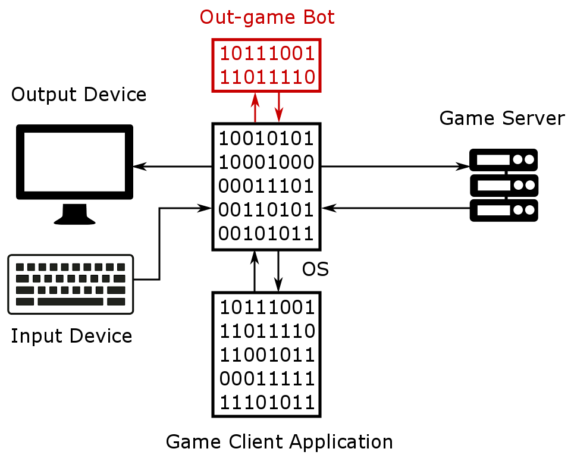
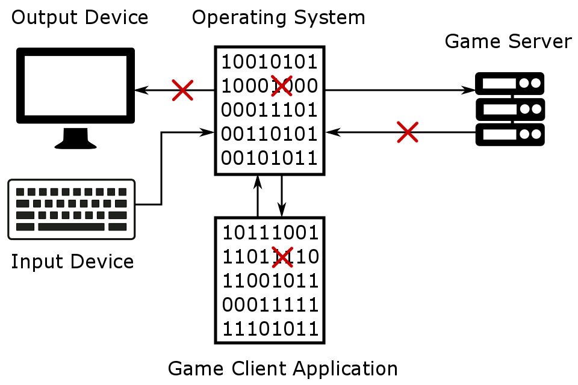

# Types of Bots

## Community Classification

You can often find references to **in-game** and **out-game** types of bots while looking for information on them on the internet. These terms are widely used and well known in a gamer community.

In-game bot is a software that is embedded inside game client application's memory. It provides its functionality by extending capabilities of the game client. This is an illustration of the in-game bot interaction with a game application:

Out-game bot is a software that works outside game client application's memory. First kind of out-game bots does not need game application at all. The bot substitutes the game client. Thus, game server thinks that it communicates with an usual game client application while in reality it is an out-game bot. This is an illustration of how this kind of out-game bots work:

Second kind of out-game bots works with a game client application in parallel. The bot is able to intercept the state of the game objects and to notify the game application about the simulated player's actions through the OS:

Also you can be faced with a mention about **clicker** bots. This is a special case of the out-game bots. Clicker bot sends keyboard and mouse event notifications to the game application through the system libraries or drivers.

We will use **community classification** term for naming these three kinds of bots.

## Developers Classification

Community classification is quite convenient for users of bot applications. But it is not enough for bot developers. The problem is that the classification does not reflect how a bot application really works and what kind of approaches it uses. It will be better to consider actual methods, that a bot application uses to intercept data about the game objects and embed data about the simulated player's actions, as a bots classification basis.

Now we will review places in our game application scheme where bot is able to intercept the state of game objects. The points of data interception are marked by red crosses:

This is a list of data interception points:

1. **Output devices**. It is possible to capture data from the output devices like monitor or audio card. Game objects have specific colors and game events are often accompanied by specific sounds. You can compare these colors or sounds with predefined values. This allows you to make conclusion about the current state of objects.

2. **Operating system**. You can substitute or modify some system libraries or drivers of operating system. This allows you to trace interactions between the game application and OS. Another way is to launch game application under an OS emulator like Wine or others. Emulators often have an advanced logging system. Thus, you will get a detailed information about each step that is performed by a game application.

3. **Game server**. [**Network packets**](https://en.wikipedia.org/wiki/Network_packet) that are sent to the game application from the game server can be intercepted. Current state of game objects is transmitted this way in most cases.

4. **Game client application**. You can get access to the game application memory and gather necessary information from there.

Result of a bot application work is simulated player actions that should be transmitted to the game server. This scheme illustrates places (points marked as green crosses) where bot application can embed data:

This is a list of the data embedding points:

1. **Input device**. Special devices can be used to emulate standard input devices. For example, you can use [**Arduino**](https://en.wikipedia.org/wiki/Arduino) board that emulates keyboard behavior. This board can be controlled by a bot application.

2. **Operating system**. Bot application is able to modify and to control some components of the operating system. For example you can modify a keyboard driver and allow your bot to notify the OS about keyboard actions through the driver. Thus, OS will not have possibility to distinguish whether the keyboard event really happened or it was bot embedded. Also you can use a standard OS interface of application interactions to embed keyboard events.

3. **Game server**. Bot application can send network packets with simulated actions directly to the game server. It can be performed the same way game client application does. Game server has no possibility to distinguish the source of network packet in some cases.

4. **Game client application**. Bot simulated actions and the game state can be embedded directly into the game application memory. Thus, game application will consider that a new state has been legally changed. The correct notification about it will be sent to the game server.

We will use **developer classification** term for naming this division of bots on types by their interception and embedding data approaches.

## Summary

Following table summarizes community and developers bots classification:

Each crossing of the row and column defines type of a bot application that uses respective methods of the data interception and data embedding. Community classification defined types of the bots are placed into the corresponding cells. 

You can see plus and minus signs inside each cell. This illustrates an approximate evaluation of two parameters balance for each type of bot:

1. How difficult is this approach in development?

2. How effective and reliable (error-free) is the bot resulting from this approach?

This is a description of possible values:

The "–" sign means that this combination of data interception and embedding methods requires an unreasonable work effort. Effectiveness and reliability of result can be easier achieved with other approaches.

The "+" sign means that this combination of methods allows you to achieve accurate and effective solution. Also it requires a reasonable amount of work.

The "++" sign marks the combinations of methods that allow you to achieve the most effective or the simplest implementation solution.

Now we can briefly explain the evaluation:

1. **Network** packets analysis is one of the most difficult ways to intercept game data. You should implement a communication protocol between the game client and the game server. Obviously there is no any official documentation regarding the protocol. Usually, everything bot developer has is a game application executable file and examples of already intercepted network packets. Moreover, network packets are often encrypted, and sometimes you have no possibility to decrypt it unambiguously. On the other hand, this approach provides the most precise and complete data about the state of game objects. Bots that are based on the network packets interception can be very efficient thanks to this detailed data.

2. **Memory** analysis is the second difficult approach to intercept game data. Game developers distribute their applications in binary codes that were produced by [**compiler**](https://en.wikipedia.org/wiki/Compiler) from a source code. You have no chance to get the exact source code of the application to investigate algorithms and data structures. Protection systems are able to relocate and to encrypt information regarding game objects in the application memory. Patching game application memory is a quite dangerous method of embedding data because of possibility to crash application. But this approach provides almost the same accurate game data as the network packets analyzing one.

3. Capturing of the **Output Device** data is one of the simplest approaches to data interception. But the result of this approach is not reliable. For example, algorithms of image analysis may be wrong in some cases. The evaluation of this approach effectiveness depends largely on the specific game application.

4. Embedding data with **Input Device** is a good way to avoid some types of [**anti-cheat protection systems**](https://en.wikipedia.org/wiki/Cheating_in_online_games#Anti-cheating_methods_and_limitations). But you need to buy the device itself and to write an appropriate firmware for it. It makes sense to use this approach only when it is necessary to avoid a game application's protection. The embedding data on the OS level works quite similar but it is easier for an protection system to detect it.

5. Intercepting data with **OS** can be a very universal and reliable method. You can find already available open source solutions for the [system library substitution](https://graphics.stanford.edu/~mdfisher/D3D9Interceptor.html) that allow you to gather information about the game application work.

You can see that a community classification covers most effective and simplest for implementation combinations of the intercepting and embedding data methods. On the other hand, rarely used and ineffective method combinations are not mentioned in the community classification. We will primarily use the community classification throughout this book. The developers classification will be used in cases when it is important to emphasize exact bot's algorithms.