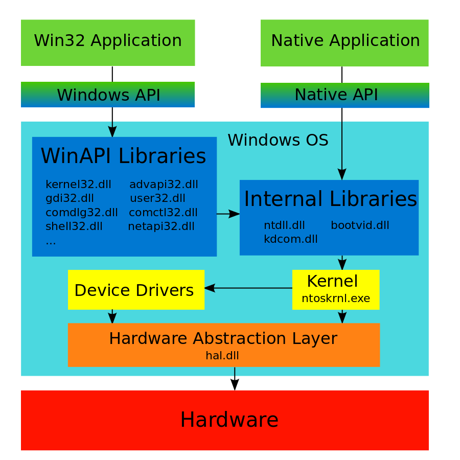
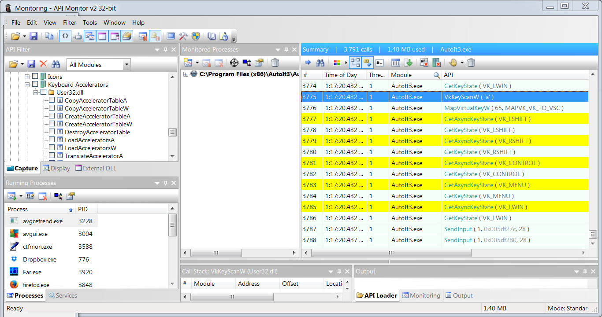

# OS Level Embedding Data

## Windows API

Main goal of an OS is managing the software and hardware resources and providing an access for launched applications to its. Memory, CPU and peripheral devices are examples of the hardware resources that are managed by OS. Example of the software resource is algorithms that are implemented into the system libraries. The Windows operation system will be considered throughout the book.

The picture illustrates how Windows provide access to the resources:



Each launched application is able to ask Windows for performing an action like creating new window, draw a line on the screen, send packet via network, allocate memory and etc. All these actions are implemented in subroutines. Subroutines that solves tasks from one domain are gathered into the system libraries. You can see kernel32.dll, gdi32.dll and etc system libraries at the picture. 

The way how application able to call Windows subroutines is strictly defined, well documented and kept unchanged. This way of communication is called Windows Application Programming Interface (API) or Windows API (WinAPI). The reason of importance API entity is keeping compatibility of new versions of an applications and new versions of Windows. Windows API can be compared with some kind of contract. If application will follow the contract Windows promise to perform its requests with the certain result.

There are two kind of application is pictured here. Win32 application is an application that interacts with a subset of Windows libraries through Windows API. Win32 is a historical name for this kind of applications that appears in the first 32-bit version of Windows (Windows NT). These libraries provides high level subroutines. High level means that these subroutines operate with complex abstractions like window, control, file and etc. This subset of Windows libraries that available through Windows API sometimes are called WinAPI libraries.

Second kind of applications is a native application. This application interacts with underlying internal Windows libraries and kernel. The libraries become available on the system boot stage, when other components of Windows are unavailable. Also the libraries provide low level subroutines. Low level subroutines operate with simple abstractions like memory page, process, thread and etc. 

The WinAPI libraries use the subroutines of the native library for implementing their complex abstractions. The implementation of the internal libraries is based onto kernel functions that are available through the system calls. 

Device drivers provide simplified representation of the devices for the overlying libraries. The representation includes a set of subroutines which implements the typical actions with the device. These subroutines are available for WinAPI libraries and Internal libraries through the kernel.

Hardware Abstraction Layer (HAL) is a software that performs some representation of the physical hardware. The main goal of this layer is assistance to launch Windows on different kind of hardware. HAL provides subroutines with the hardware specific implementation for both device drivers and kernel. But interface of the subroutines is kept the same and it doesn't depend on the underlying hardware. It allows drivers and kernel developers to minimize their changes in source code to port Windows on new platforms.

## Keyboard Strokes Emulation

### AutoIt Function

First of all it will be useful to investigate AutoIt provided ways for keyboard strokes emulation. The most appropriate way is a [**Send**](https://www.autoitscript.com/autoit3/docs/functions/Send.htm) function according to the list of [available varaints](https://www.autoitscript.com/autoit3/docs/functions.htm).

Our test application will press the "a" key into the already opened Notepad window. This is an algorithm of the application work:

1. Find an opened Notepad window
2. Switch to the Notepad window
3. Emulate "a" key pressing

The Notepad window able to be found with the [**WinGetHandle**](https://www.autoitscript.com/autoit3/docs/functions/WinGetHandle.htm) function. The first parameter of the function can be window title, window handle or window class. We will specify the window class as more reliable variant. These are steps to investigate class of the Notepad window:

1. Open the **C:\Program Files\AutoIt3\Au3Info.exe** application. Your AutoIt installation path can be different.
2. Drag-and-drop **Finder Tool** to the Notepad window.
3. You will get result like this:


The information that we are looking for specified in the **Class** field of the **Basic Window Info** block. The value of the window class is **Notepad**.

This is a **Send.au3** application code for implementing our algorithm:
```
$hWnd = WinGetHandle("[CLASS:Notepad]")
WinActivate($hWnd)
Send("a")
```
Here we get window handle of the Notepad window with the **WinGetHandle** function. Next step is switching to the window with the **WinActivate** function. And last step is emulating "a" key pressing. You can just put this code into the file with **Send.au3** name and launch it by double click.

### AutoIt Function Internal

Actually the **Send** AutoIt function uses one of the WinAPI subroutines or functions. It will be useful to discover which one of the possible WinAPI functions have been used. [API Monitor v2](http://www.rohitab.com/apimonitor) is a suitable tool for monitoring API calls made by an application. We will rely on it for our investigation.

These are steps to monitor **Send.au3** application WinAPI calls:

1. Launch **API Monitor 32-bit** application.
2. Find (Ctrl+F) and select the **Keyboard an Mouse Input** item in the **API Filter** child window.
3. Press Ctrl+M to **Monitor New Process**.
4. Specify **C:\Program Files\AutoIt3\AutoIt3.exe** in the **Process** field and press **OK** button.
5. Specify the **Send.au3** application in the opened **Run Script** dialog. The application will be launched after this action.
6. Find (Ctrl+F) the **'a'** text with single quotes in the **Summary** child window of the API Monitor application.

You will get a result similar to this:



**VkKeyScanW** is a function that explicitly get 'a' character as parameter. But it doesn't perform the keystroke emulation according to WinAPI documentation. Actually, **VkKeyScanW** and a next called **MapVirtualKeyW** functions are used for preparing input parameters for the **SendInput** function. **SendInput** performs actual work for emulating keystroke.

Now we can try to implement our algorithm of pressing "a" key into Notepad window through direct interaction with WinAPI functions. The most important thing now is a way to kystrokes emulation. Thus, usage the **WinGetHandle** and **WinActivate** AutoIt function will be kept.

This is a **SendInput.au3** application code for implementing the algorithm through WinAPI interaction:
```
$hWnd = WinGetHandle("[CLASS:Notepad]")
WinActivate($hWnd)
Send("a")
```

>>> CONTINUE

### WinAPI Functions


WinAPI provides the simplest way to emulate a keystroke in the application window. There are several subroutines or functions with the similar behavior like SendMessage, SendMessageCallback, SendNotifyMessage, PostMessage and PostThreadMessage. All these functions will send a message to the window with the specified [handle](http://stackoverflow.com/questions/902967/what-is-a-windows-handle) or identifier.

TODO: Write about example with input text in Notepad window

TODO: Give example with bare WinAPI (for C++ programmers)

TODO: Write about tricks with random timeouts

interception
2. **Operation system**. You can substitute or modify some libraries or drivers of operation system. This allows you to trace the interaction between game application and OS. Another way is launching game application under an emulator of the operation system like Wine. Emulators have an advanced logging system often. Thus, you will get a detailed information about each step of the game application work.

embedding
2. **Operation system**. Components of the operation system able to be modified for becoming controlled by the bot application. You can modify a keyboard driver and allow a bot to notify the OS about keyboard actions through the driver for example. Thus, OS will not have possibility to distinguish whether the keyboard event really happened or it was embed by the bot. Also you can use a standard OS interface of applications interaction to notify game application about the embedded by bot keyboard events.

## Extra Keyboard Driver

TODO: Write here about the InpOut library. What it allows to do? How it works?

http://www.highrez.co.uk/Downloads/InpOut32/
http://logix4u.net/parallel-port/16-inpout32dll-for-windows-982000ntxp

## Mouse Actions Emulation

TODO: Write about example with drawing in Paint

TODO: Information from "Types of Bots" section
