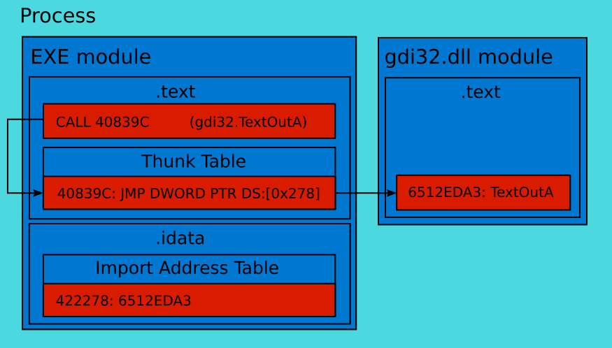

# OS Level Interception Data

## Tools

We will work with Windows API functions in this chapter. C++ language is the best choice for this task. We will use the [Visual Studio 2015 Community IDE](https://www.visualstudio.com/en-us/products/visual-studio-express-vs.aspx#) to compile our examples. More details about this IDE is available in the [In-game Bots](../InGameBots/tools.md) chapter.

There are several open source solutions to simplify process of hook WinAPI calls.

First solution is [DLL Wrapper Generator](https://m4v3n.wordpress.com/2012/08/08/dll-wrapper-generator/), which can help us to create proxy DLLs.

There are steps to install DLL Wrapper Generator:

1. Download the scripts on the github [project page](https://github.com/mavenlin/Dll_Wrapper_Gen/archive/master.zip).

2. Download and install [Python 2.7 version](https://www.python.org/downloads/)

Now we are ready to work with DLL Wrapper Generator.

Second solution to hook WinAPI calls is [Deviare](http://www.nektra.com/products/deviare-api-hook-windows/) open source hooking engine.

There are steps to install Deviare software:

1. Download the last version of the [release binaries](https://github.com/nektra/Deviare2/releases/download/v2.8.0/Deviare.2.8.0.zip).

2. Download the latest version of the [source code](https://github.com/nektra/Deviare2/archive/v2.8.0.zip).

3. Unpack both archives in two different directories.

You can find a list of all available Deviare releases in the [github project](https://github.com/nektra/Deviare2/releases). Please make sure that the version of binaries matches to the version of sources.

## Test Application

We will use the same application to test WinAPI calls hooking techniques as we used in the [protection against in-game bots](../InGameBots/protection.md) section.

This is a source code of the [`TestApplication.cpp`](https://ellysh.gitbooks.io/video-game-bots/content/Examples/ExtraTechniques/OSLevelInterceptionData/TestApplication.cpp):
```C++
#include <stdint.h>
#include <windows.h>
#include <string> 

static const uint16_t MAX_LIFE = 20;
volatile uint16_t gLife = MAX_LIFE;

int main()
{
    SHORT result = 0;

    while (gLife > 0)
    {
        result = GetAsyncKeyState(0x31);
        if (result != 0xFFFF8001)
            --gLife;
        else
            ++gLife;
        
        std::string str(gLife, '#');
        TextOutA(GetDC(NULL), 0, 0, str.c_str(), str.size());

        printf("life = %u\n", gLife);
        Sleep(1000);
    }
    printf("stop\n");
    return 0;
}
```
Algorithm of this application still the same. We decrement the `gLife` variable each second if the *1* keyboard key is not pressed. Otherwise, we increment the `gLife`. New feature of the application is a call of the `TextOutA` WinAPI function. This function prints the hash symbols in the upper-left corner of your screen. Count of printed symbols equals to the value of `gLife`.

Now our goal is to hook the `TextOutA` function call and to get its last parameter, which has the same value as the `gLife` variable.

## DLL Import

Before we start to consider WinAPI hooking, it will be useful to know how application interacts with DLL. When we start an application, Windows loader reads executable file into process memory. Typical Windows executable file has [**PE**](https://msdn.microsoft.com/en-us/library/ms809762.aspx) format. This format is a standard for data structures, which are stored in file's header. These structures contain necessary information to launch executable code by the Windows loader. List of required DLLs is a part of this information.

Next step of the loader is to find files of all required DLLs on a disk drive. These files are read into the process memory too. Now we face an issue. Locations of the DLL modules in a process memory are not constant. These locations can vary for different versions of the same DLL. Therefore, compiler cannot hardcode addresses of DLL functions in the executable module. This issue is solved by [**Import Table**](http://sandsprite.com/CodeStuff/Understanding_imports.html). There is some kind of confusion with Import Table and **Thunk Table**.

Each element of Import Table matches to one imported DLL module. This element contains name of the module, `OriginalFirstThunk` pointer and `FirstThunk` pointer. You can find more details about these pointers [here](http://ntcore.com/files/inject2it.htm). The `OriginalFirstThunk` points to the first element of array with ordinal numbers and names of the imported functions. The `FirstThunk` points to the first element of array (also known as Import Address Table or IAT), which is overwritten by Windows loader with actual addresses of the imported functions. And this is a source of confusion because both these arrays do not contain any stuff that is named [**thunk**](https://en.wikipedia.org/wiki/Thunk#Overlays_and_dynamic_linking).

Import Table is a part of PE header and it contains constant meta information about imported DLLs. This table is stored in the read-only process memory segment with PE header. Thunk table (also known as jump table) is a part of executable code and it contains `JMP` instructions to transfer control to the imported functions. This table is placed in the read and executable `.text` segment with all other application code. Import Address Table is stored in the read and write `.idata` segment. The `.idata` segment also contains an array, which is pointed by `OriginalFirstThunk`. As you see all three tables are placed in different segments.

This scheme illustrates a call of DLL function from the MinGW compiler generated code:



This scheme illustrates the same call from the Visual C++ compiler generated code:


You can see that Visual C++ compiler uses the IAT address directly without extra jump via Thunk Table.

## API Hooking Techniques

Game application interacts with Windows via system DLLs. Such operations as displaying a picture on the screen are performed by WinAPI functions. It is possible to get a state of the game objects by hooking calls to these functions. This approach reminds the output device capture. But now we can analyze data before it will come to the output device. This data can be a picture, sound, network packet or set of bytes in a temporary file.

You can see how API hooking works by launching a [API Monitor](../ClickerBots/tools.md) tool. This tool prints the hooked calls in the "Summary" sub-window. We can implement a bot application that behaves in a similar way. But unlike the API monitor a bot should simulate player actions instead of printing hooked calls.

Now we will briefly consider most common API hooking techniques. 

### Proxy DLL

TODO: Make the schemes.

TODO: Briefly describe advantages and disadvantages of below approaches.

### IAT Patching

### API Patching

This [article](http://www.internals.com/articles/apispy/apispy.htm) describes these approaches in details.

## Test Application

## Deviare Hooking Engine

## Bot Application

## Summary