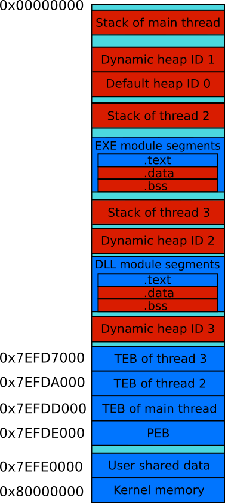

# Process Memory Analyzing

## Process Memory Overview

Process memory topic has been already described in many books in articles. We will consider points of the topic here that are the most important for practical goal of analyzing process memory.

First of all, it will be useful to emphasize a difference between an executable binary file and a working process from point of view of provided information for analyzing. We can compare executable file with a bowl. This bowl defines a future form of the poured liquid of data. Executable file contains algorithms for processing data, implicit description of ways to interpret data, global and static variables. Data description is represented by encoded rules of [**type system**](https://en.wikipedia.org/wiki/Type_system). Therefore, it is possible to investigate ways of data processing and representation, and values of initialized global and static variables from analyzing the executable file. When executable file is launched liquid starts to pour into a bowl. OS load executable file into the memory and starts to execute file's instructions. Typical results of instructions execution are allocation, modification or deallocation memory. It means that you can get actual information of application's work in the [**run-time**](https://en.wikipedia.org/wiki/Run_time_%28program_lifecycle_phase%29) only.

This is a scheme with components of a typical Windows process:

You can see that typical Windows process consist of several modules. EXE module exist always. It matches to the executable file that have been loaded to the memory at application launch. All Windows applications use at least one library which provides access to WinAPI functions. Compiler will link some libraries by default even if you does not use WinAPI functions explicitly in the application. This is a point where will be useful describe two types of libraries. There are dynamic-link libraries ([**DLL**](https://support.microsoft.com/en-us/kb/815065)) and static libraries. Key difference between them is a time of resolving dependencies. If executable file depends on a static library, the library should be available at compile time. Linker will produce one resulting file that contains both sources of static library and executable file. If executable file depemnds on a DLL, the DLL should be available at compile time too. But resulting file will not contain sources of the library. It will be founded and loaded in process's memory at run-time by OS. Launched application will crash if OS will not found a required DLL. This kind of loaded in the process's memory DLLs is a second type of modules.

[**Thread**](https://en.wikipedia.org/wiki/Thread_%28computing%29) is a set of instructions that can be executed separately from others in concurrent manner. Actually threads interacts between each other by shared resources such as memory. But OS is free to select which thread will be executed currently. You can see in the scheme that each module is able to contain one or more threads or do not contain threads at all. EXE module always contains a main thread which will be launched at application start by OS.

Described scheme focuses on a mechanism of application's execution. Now we will consider a memory layout of a typical Windows application.

TODO: Make a picture of process memory (stack, heap, module's segments)

## Variables Searching 

### Search in Module's Segments

### Search in Heap

TODO: Describe the heap growing process with example application

TODO: Describe WinAPI functions for looking for all heap's segments

### Search in Stack

TODO: Describe the stack growing process with example application

TODO: Describe WinAPI functions for looking for all stack's segments
