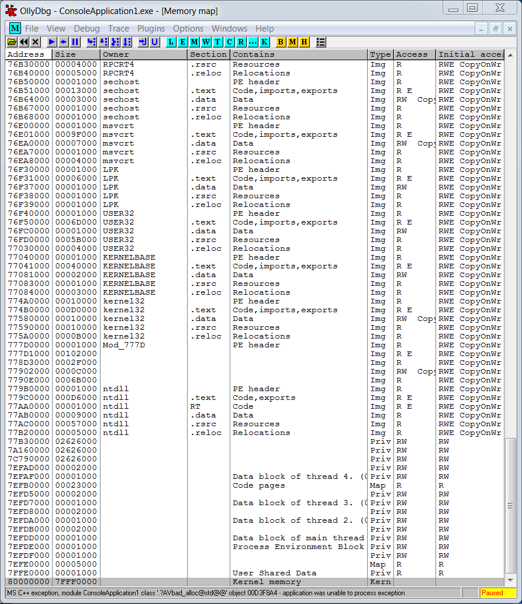
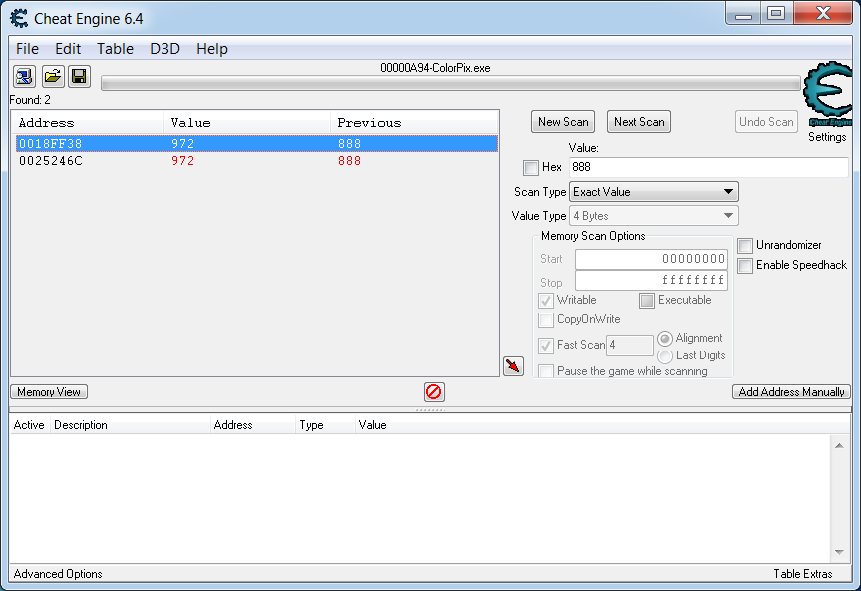
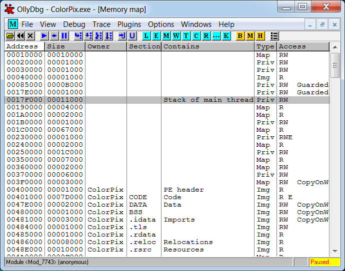
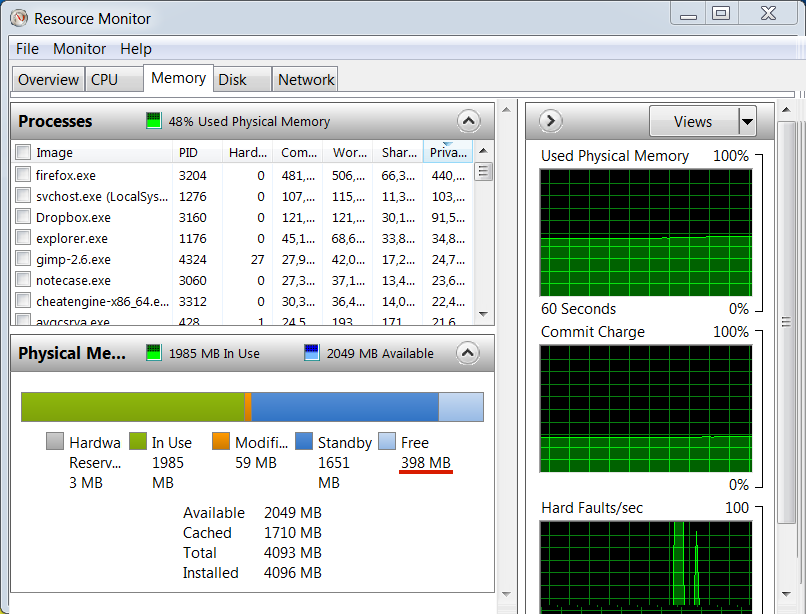
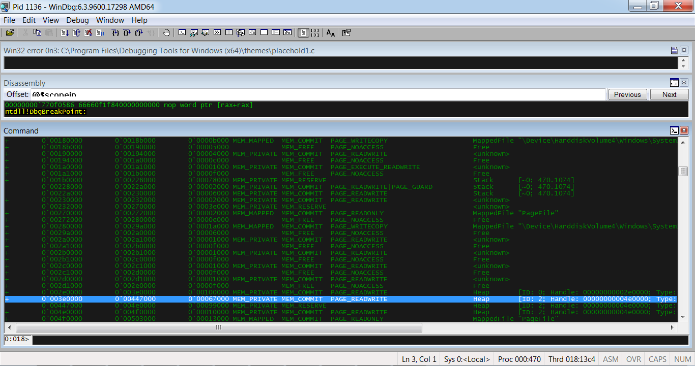

# Process Memory Analyzing

## Process Memory Overview

Process memory topic has been already described in many books and articles. We will consider points of the topic here that are the most important for a practical goal of analyzing process memory.

First of all, it will be useful to emphasize a difference between an executable binary file and a working process from point of view of available information about a game state. We can compare executable file with a bowl. Data can be compared with liquid. The bowl defines future form of liquid that will be poured inside it. Executable file contains algorithms of processing data and implicit description of ways to interpret data. This description of data interpretation is represented by encoded rules of [**type system**](https://en.wikipedia.org/wiki/Type_system). 

When executable file is launched liquid starts to pour into a bowl. First of all, OS loads the file into memory. Then OS manages execution of [**machine code**](https://en.wikipedia.org/wiki/Machine_code) from the loaded executable file. Typical results of machine code execution are allocation, modification or deallocation memory. It means that you can get actual information of a game state in the [**run-time**](https://en.wikipedia.org/wiki/Run_time_%28program_lifecycle_phase%29) only.

This is a scheme with components of a typical Windows process:


You can see that typical Windows process consists of several modules. EXE module exists always. It matches to the executable file that is loaded into a memory when application has been launched. All Windows applications use at least one library which provides access to WinAPI functions. Compiler will link some libraries by default even if you does not use WinAPI functions explicitly in your application. Such WinAPI functions as `ExitProcess` or `VirtualQuery` are used by all applications for correct termination or process's memory management. These functions are embedded implicitly into the application's code by a compiler.

This is a point where it will be useful to describe two types of libraries. There are [**dynamic-link libraries**](https://support.microsoft.com/en-us/kb/815065) (DLL) and static libraries. Key difference between them is a time of resolving dependencies. If executable file depends on a static library, the library should be available at compile time. Linker will produce one resulting file that contains both machine code of the static library and executable file. If executable file depends on a DLL, the DLL should be available at the compile time too. But resulting file will not contain machine code of the library. It will be founded and loaded by OS into the process's memory at run-time. Launched application will crash if OS will not found the required DLL. This kind of loaded into process's memory DLLs is a second type of modules.

[**Thread**](https://en.wikipedia.org/wiki/Thread_%28computing%29) is smallest portion of machine code that can be executed separately from others in a concurrent manner. Actually threads interacts between each other by shared resources such as memory. But OS is free to select which thread will be executed at the moment. Number of simultaneously executed threads is defined by a number of CPU cores. You can see in the scheme that each module is able to contain one or more threads, or module is able to not contain threads at all. EXE module always contains a main thread which will be launched by OS on the application start.

Described scheme focuses on details of application's execution. Now we will consider a memory layout of a typical Windows application.


You can see an [**address space**](https://en.wikipedia.org/wiki/Virtual_address_space) of the application. The address space is split into memory locations that are named [**segments**](https://en.wikipedia.org/wiki/Segmentation_%28memory%29). Each segment has [**base address**](https://en.wikipedia.org/wiki/Base_address), length and set of permissions (for example write, read, execute.) Splitting memory into segments simplifies memory management. Information about segment's length allows to hook violation of segment's bounds. Segment's permissions allow to control access to the segment.

The illustrated process have three threads including the main thread. Each thread has own [**stack segment**](https://en.wikipedia.org/wiki/Call_stack). Also there are several [**heap segments**](https://msdn.microsoft.com/en-us/library/ms810603) that can be shared between all threads. The process contains two modules. First is a mandatory EXE module and second is a DLL module. Each of these modules has mandatory segments like [`.text`](https://en.wikipedia.org/wiki/Code_segment), [`.data`](https://en.wikipedia.org/wiki/Data_segment#Data) and [`.bss`](https://en.wikipedia.org/wiki/.bss). Also there are extra module's segments like `.rsrc` that are not mentioned in the scheme.

This is a brief description of each segment in the scheme:

| Segment | Description |
| -- | -- |
| Stack of main thread | Contains call stack, parameters of the called functions and [**automatic variables**](https://en.wikipedia.org/wiki/Automatic_variable). The segment is used only by the main thread. |
| Dynamic heap ID 1 | Dynamic heap that is created by default on application start. This kind of heaps can be created and destroyed on the fly during the process's work. |
| Default heap ID 0 | Heap that have been created by OS at application start. This heap is used by all global and local memory management functions, if a handle to the certain dynamic heap is not specified. |
| Stack of thread 2 | Contains call stack, function parameters and automatic variables that are specific for thread 2 |
| EXE module `.text` | Contains executable machine code of the EXE module |
| EXE module `.data` | Contains not constant [**globals**](https://en.wikipedia.org/wiki/Global_variable) and [**static variables**](https://en.wikipedia.org/wiki/Static_variable) of the EXE module that have predefined values |
| EXE module `.bss` | Contains not constant globals and static variables of the EXE module that have not predefined values |
| Stack of thread 3 | Contains call stack, function parameters and automatic variables that are specific for thread 3 |
| Dynamic heap ID 2 | Dynamic heap that have been created automatically by a [**heap manager**](http://wiki.osdev.org/Heap) when the default heap has reached a maximum available size. This heap extends the default heap. |
| DLL module `.text` | Contains executable machine code of the DLL module |
| DLL module `.data` | Contains not constant globals and static variables of the DLL module that have predefined values |
| DLL module `.bss` | Contains not constant globals and static variables of the DLL module that have not predefined values |
| Dynamic heap ID 3 | Dynamic heap that have been created by the heap manager when the dynamic heap with ID 2 has reached a maximum available size |
| TEB of thread 3 | [**Thread Environment Block**](https://en.wikipedia.org/wiki/Win32_Thread_Information_Block) (TEB) or **Thread Information Block** (TIB) is a data structure that contains information about thread 3 |
| TEB of thread 2 | TEB that contains information about thread 2 |
| TEB of main thread | TEB that contains information about a main thread |
| PEB | [**Process Environment Block**](https://msdn.microsoft.com/en-us/library/windows/desktop/aa813706%28v=vs.85%29.aspx) (PEB) is a data structure that contains information about a whole process |
| User shared data | Contains memory that is shared by current process with other processes |
| Kernel memory | Contains memory that is reserved by OS purposes like device drivers and system cache |

Segments that are able to store a state of game objects are market by red color in the scheme. Base addresses of these segments are assigned at the moment of application start. It means that these addresses will differ each time when you launch an application. Moreover, sequence of these segments in the process's memory is not predefined too. On the other hand, base addresses and sequence of some segments are predefined. Examples of these segments are PEB, user shared data and kernel memory.

OllyDbg debugger allows you to get memory map of a working process. This is a screenshot of a memory map analyzing feature of the debugger:




First screenshot represent beginning of the process's address space. There is an end of process's address space at the second screenshot. You can see the same segments on the screenshots as ones in the scheme:

| Address | Segment |
| -- | -- |
| 001ED000 | Stack of main thread |
| 004F0000 | Dynamic heap with ID 1 |
| 00530000 | Default heap with ID 0 |
| 00ACF000<br>00D3E000<br>0227F000 | Stacks of additional threads |
| 00D50000-00D6E000 | Segments of the EXE module with "ConsoleApplication1" name |
| 02280000-0BB40000<br>0F230000-2BC70000 | Extra dynamic heaps |
| 0F0B0000-0F217000 | Segments of the DLL module with "ucrtbased" name |
| 7EFAF000<br>7EFD7000<br>7EFDA000 | TEB of additional threads |
| 7EFDD000 | TEB of main thread |
| 7EFDE000 | PEB of main thread |
| 7FFE0000 | User shared data |
| 80000000 | Kernel memory |

You can notice that OllyDbg does not detect extra dynamic heaps automatically. You can use WinDbg debugger or HeapMemView utility to clarify base addresses of all heap segments.

## Variables Searching

Bot application should read a state of game objects from a game process's memory. The state can be stored in variables from several different segments. Base addresses of these segments and offsets of variables inside the segments can be changed each time when game application is launched. This means that final absolute address of each variable is not constant value. Therefore, the bot should have an algorithm of searching variables in process's memory that allows to deduce absolute addresses of specific variables.

We have used a term "absolute address" here but it is not precise in terms of [**x86 memory segmentation model**](https://en.wikipedia.org/wiki/X86_memory_segmentation). Absolute address in terms of this model is named **linear address**. This is a formula for calculation a linear address:
```
linear address = base address + offset
```
We will continue to use "absolute address" term for simplification as more intuitive understanding one. The "linear address" term will be used when nuances of x86 memory segmentation model will be discussed.

Task of searching a specific variable in a process's memory is able to be divided into three subtasks:

1. Find a segment which contains the variable.
2. Define a base address of this segment.
3. Define an offset of the variable inside the segment.

Most probably, the variable will be kept in the same segment on each launch of game application. Storing the variable in a heap is only one case when the owning segment can vary. It happens because of dynamic heaps creation mechanism. Therefore, it is possible to solve first task by analyzing process's memory in a run-time manually and then to hardcode the result into a bot. 

It is not guarantee that variable's offset inside a segment will be the same on each game application launch. But the offset may remain constant during several application launches in some cases, and the offset can vary in other cases. Type of owning segment defines probability that variables' offsets inside this segment will be constant. This is a table that describes this kind of probability:

| Segment Type | Offset Constancy |
| -- | -- |
| `.bss` | Always constant |
| `.data` | Always constant |
| stack | Offset is constant in most cases. It can vary when [**control flow**](https://en.wikipedia.org/wiki/Control_flow) of application execution differs between new application launches. |
| heap | Offset vary in most cases |

Task of segment's base address definition should be solved by a bot each time when a game application is launched.

### 32-bit Application Analyzing

We will use [ColorPix](https://www.colorschemer.com/colorpix_info.php) 32-bit application to demonstrate an algorithm of searching specific variable in process's memory. Now we will perform the algorithm manually to understand each step better.

ColorPix application have been described and used in "Clicker Bots" chapter. This is a screenshoot of the application's window:


We will looking for a variable in memory that matches the X coordinate of a selected pixel on a screen. This value is displayed in the application's window and underscored by a red line in the screenshot.

It is important to emphasize that you should not close the ColorPix application during all process of analysis. If you close and restart the application you should start to search variable from the beginning.

First task is looking for a memory segment which contains a variable with X coordinate. This task can be done in two steps:

1. Find absolute address of the variable with Cheat Engine memory scanner.
2. Compare discovered absolute address with base addresses and lengths of segments in the process's memory. It will allow to deduce a segment which contains the variable.

This is an algorithm of searching the variable's absolute address with Cheat Engine scanner:

1\. Launch 32-bit version of the Cheat Engine scanner with administrator privileges.

2\. Select "Open Process" item of the "File" menu. You will see a dialog with list of launched applications at the moment:


3\. Select the process with a "ColorPix.exe" name in the list, and press "Open" button. Now the process's name is displayed above a progress bar at the top of Cheat Engine's window.

4\. Type current value of the X coordinate into the "Value" control of the Cheat Engine's window.

5\. Press the "First Scan" button to start searching the typed value into a memory of ColorPix process. Number in the "Value" control should match the X coordinate, that is displayed in ColorPix window at the moment when you are pressing the "First Scan" button. You can use *Tab* and *Shift+Tab* keys to switch between "Value" control and "First Scan" button. It allows you to keep pixel coordinate unchanged during switching.

Search results will be displayed in a list of Cheat Engine's window:



If there are more than two absolute addresses in the results list you should cut off inappropriate variables. Move mouse to change X coordinate of the current pixel. Then type a new value of X coordinate into the "Value" control and press "Next Scan" button. Be sure that the new value differs from the previous one. There are still present two variables in the results list after cutting of inappropriate variables. Absolute addresses of them equal to "0018FF38" and "0025246C".

Now we know absolute address of two variables that match to X coordinate of selected pixel. Next step is investigation segments in process's memory with debugger. It allows us to figure out the segments which contains the variables. OllyDbg debugger will be used in our example.

This is an algorithm of searching the segment with the OllyDbg debugger:

1\. Launch OllyDbg debugger with administrator privileges. Example path of the debugger's executable file is `C:\Program Files (x86)\odbg201\ollydbg.exe`.

2\. Select "Attach" item of the "File" menu. You will see a dialog with list of launched 32-bit applications at the moment:


3\. Select the process with a "ColorPix.exe" name in the list and press "Attach" button. When attachment will be finished, you will see a "Paused" text in the right-bottom corner of the OllyDbg window.

4\. Press *Alt+M* to open memory map of the ColorPix process. The OllyDbg window should looks like this now:



You can see that variable with absolute address 0018FF38 matches the "Stack of main thread" segment. This segment occupies addresses from "0017F000" to "00190000" because a base address of the next segment equals to "00190000". Second variable with absolute address 0025246C matches to unknown segment with "00250000" base address. It will be more reliable to choose "Stack of main thread" segment for reading value of the X coordinate in future. There is much easer to find a stack segment in process's memory than some kind of unknown segment.

Last task of searching a specific variable is calculation a variable's offset inside the owning segment. Stack segment grows down for x86 architecture. It means that stack grows from higher addresses to lower addresses. Therefore, base address of the stack segment equals to upper segment's bound i.e. 00190000 for our case. Lower segment's bound will change when stack segment grows.

Variable's offset equals to subtraction of a variable's absolute address from a base address of the segment. This is an example of calculation for our case:
```
00190000 - 0018FF38 = C8
```
Variable's offset inside the owning segment equals to C8. This formula differs for heap, `.bss` and `.data` segments. Heap grows up, and its base address equals to lower segment's bound. `.bss` and `.data` segments does not grow at all and their base addresses equal to the lower segments' bounds too. You can follow the rule to subtract a smaller address from a larger one to calculate variable's offset correctly.

Now we have enough information to calculate an absolute address of the X coordinate variable for new launches of ColorPix application. This is an algorithm of absolute address calculation and reading a value of X coordinate:

1. Get base address of the main thread's stack segment. This information is available from the TEB segment.
2. Calculate absolute address of the X coordinate variable by adding the variable's offset 10F38 to the base address of the stack segment.
3. Read four bytes from the ColorPix application's memory at the resulting absolute address.

As you see, it is quite simple to write a bot application that will base on this algorithm.

You can get a dump of TEB segment with OllyDbg by left button double-clicking on "Data block of main thread" segment in the "Memory Map" window. This is a screenshot of resulting TEB dump for ColorPix application:


Base address of the stack segment equals to "00190000" according to the screenshot.

### 64-bit Application Analyzing

Algorithm of manual searching variable for 64-bit applications differs from the algorithm for 32-bit applications. Both algorithms have the same steps. But the problem is, OllyDbg debugger does not support 64-bit applications now. We will use WinDbg debugger instead the OllyDbg one in our example.

Memory of Resource Monitor application from Windows 7 distribution will be analyzing here. Bitness of Resource Monitor application matches to the bitness of the Windows OS. It means that if you have 64-bit Windows version, bitness of Resource Monitor will be equal to 64-bit too. You can launch the application by typing `perfmon.exe /res` command in a search box of "Start" Windows menu. This is the application's screenshot:



The "Free" memory amount is underscored by red line. We will looking for a variable in the process's memory that stores the corresponding value.

First step of looking for a segment which contains a variable with free memory amount still the same as one for 32-bit application. You can use 64-bit version of Cheat Engine scanner to get an absolute address of the variable. There are to variables that store free memory amount with "00432FEC" and "00433010" absolute addresses for my case. You can get totally different absolute addresses, but it does not affect the whole algorithm of searching variables.

Second step of comparing process's memory map with variables' absolute addresses differs from 32-bit application one, because we will use WinDbg debugger. This is an algorithm of getting process's memory map with WinDbg:

1\. Launch 64-bit version of the WinDbg debugger with administrator privileges. Example path of the debugger's executable file is `C:\Program Files (x86)\Windows Kits\8.1\Debuggers\x64\windbg.exe`.

2\. Select "Attach to a Process..." item of the "File" menu. You will see a dialog with list of launched 64-bit applications at the moment:


3\. Select the process with a "perfmon.exe" name in the list and press "OK" button.

4\. Type `!address` in the command line at bottom of "Command" window, and press *Enter*. You will see a memory map of the Resource Monitor application in the "Command" window:



You can see that both variables with absolute addresses 00432FEC and 00433010 match the first heap segment with ID 2. This segment occupies addresses from "003E0000" to "00447000". We can use first variable with 00432FEC absolute address for reading free memory amount.

This is a calculation of the variable's offset:
```
00432FEC - 003E0000 = 52FEC
```
This is an algorithm of absolute address calculation and reading a value of free memory amount from a launched Resource Monitor application:

1. Get base address of the heap segment with ID 2. You can use a set of WinAPI functions to traverse a process's heap segments: `CreateToolhelp32Snapshot`, `Heap32ListFirst` and `Heap32ListNext`.
2. Calculate an absolute address of a free memory amount variable by adding the variable's offset 52FEC to the base address of the heap's segment.
3. Read four bytes from the Resource Monitor application's memory at the resulting absolute address.