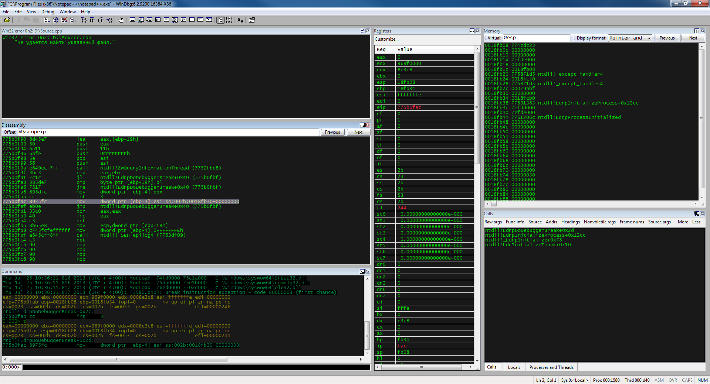

# Tools

## Programming Language

C++ language will be used in this chapter. It is recommended to use freeware [Visual Studio 2015 Community IDE](https://www.visualstudio.com/en-us/products/visual-studio-express-vs.aspx#) instead of open source MinGW environment. The issue with MinGW is a leak of support importing of some Windows library for example **dbghelp.dll**. You can try to compile examples of this chapter with MinGW but you should be ready to switch to Visual Studio in case of issues.

Do not forget to update [**Internet Explorer**](http://windows.microsoft.com/en-us/internet-explorer/download-ie) application to 11 version for usage Visual Studio 2015.

## Debugger

[**OllyDbg**](http://www.ollydbg.de) is a freeware debugger that will be used in this chapter. It has user-friendly graphical interface that simplify studying this debugger. OllyDbg provides wide functionality to investigate Windows applications without a source code. It allows to debug and [**disassemble**](https://en.wikipedia.org/wiki/Disassembler) 32-bit Windows applications only. One of the base features that will help us to investigate game applications is providing a memory map of a process.

[**x64dbg**](http://x64dbg.com) is an open source debugger for Windows. It have almost the same user-friendly interface as OllyDbg. x64dbg supports both 32-bit and 64-bit applications. It has less features when OllyDbg debugger. Therefore, some calculations should be perform manually to investigate a process's memory. It is recommended to use x64dbg for debugging 64-bit applications only and OllyDbg in other cases.

[**WinDbg**](https://msdn.microsoft.com/en-us/windows/hardware/hh852365) is a freeware debugger with extremely powerful features that allows you to debug user mode applications, device drivers, OS libraries and kernel. WinDbg supports both 32-bit and 64-bit applications. Poor user interface is only one serious drawback of this debugger. This drawback can be solved by special [theme](https://github.com/Deniskore/windbg-workspace) that improves the interface and make it looks like OllyDbg one. Most of the WinDbg features are available through [commands](http://www.windbg.info/doc/1-common-cmds.html).

These are steps to install new theme for WinDbg:
1. Unpack all files from archive `windbg-workspace-master.zip` to the directory with themes. This is a path to the directory for default WinDbg installation: `C:\Program Files (x86)\Windows Kits\8.1\Debuggers\x64\themes`.
2. Launch the `windbg.reg` file and press "Yes" button in both dialog pop-up windows.

Now main window of WinDbg should look like this screenshot after launch:

## Memory Analyzing Tools

[**Cheat Engine**](http://www.cheatengine.org/) is open source tool that combines features of memory scanner, debugger and hex editor. Cheat Engine allows you to find an address of the specific variable in a process of Windows application and modify the variable. This feature will be used to gather information for implementation in-game bots.

[**HeapMemView**](http://www.nirsoft.net/utils/heap_memory_view.html) is a freeware utility for investigation heap segments of the process. There are two separate versions of utility for analysis 32-bit and 64-bit Windows applications.